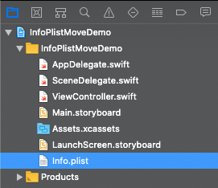
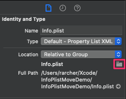
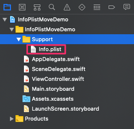
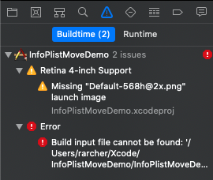
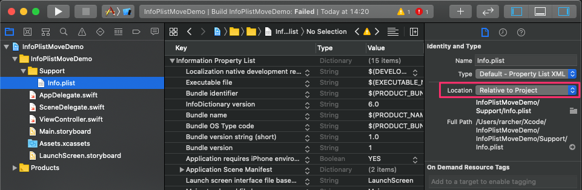
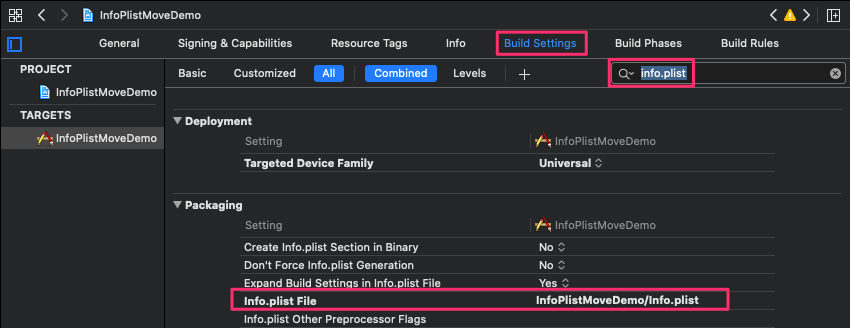
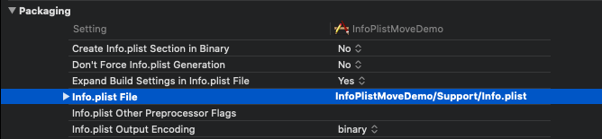

# Xcode Move Info.plist to Folder
## Resolving issues when moving Info.plist out of the project root Folder

With a large project it's often useful to move your Info.plist file into a "support" folder, along with other
files like storyboards, etc.:

Prior to Xcode 11 you could just create a Group, move the file and then adjust the full path as necessary
by tapping the folder icon in the File Inspector view of Info.plist:

However, with Xcode 11 this no longer works. The following shows how to workaround this issue.

___

## Workaround
Create a new **Group** (with folder) and move **Info.plist** into it:

At this point if you rebuild you'll get an error:

Select **Info.plist** and then change the **Location** in **File Inspector** from *Relative to Group*
to **Relative to Project**:

You'll still get an error if you rebuild, even though the **Location** and **Full Path** correctly
show the location to Info.plist.

Open your project's **Build Settings** and search for **Info.plist**:

Change the location of the file to the correct *project-relative* path:

If you now rebuild you’ll have no errors.
